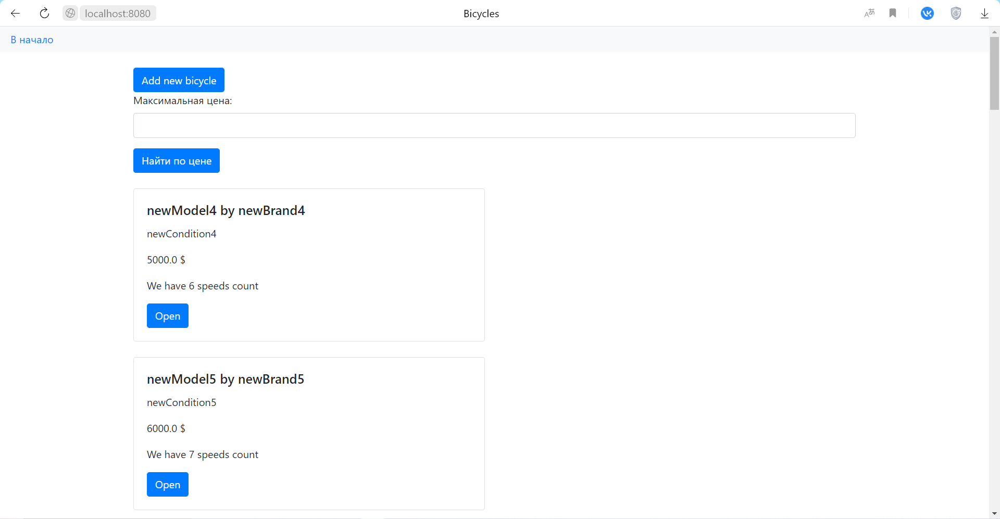
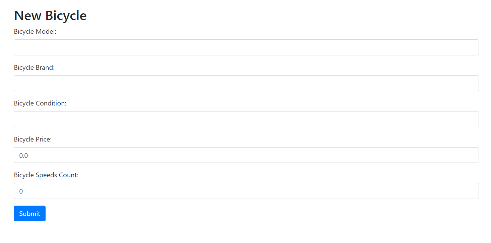

# Практическая работа №8
### Spring JMS
## Цель работы:
Ознакомиться с механизмом JMS в Spring.
## Общая постановка задачи:

Изменить приложение из практического задания №7, №6 или №5 (на усмотрение студента) и добавить следующие возможности (пункты со "снежинкой" желательны, но не обязательны):

1) Настроить очередь (Для ActiveMQ или любого другого брокера сообщений JMS) приема сообщений для администратора.

2) При выполнении операций добавления, удаления или редактирования ресурса через REST API / форму создавать соответствующие уведомления и отправлять их в очередь.

3) Любым удобным способом (можно через терминал) продемонстрировать извлечение административных сообщений о выполненных операциях (из п.2).

4) Добавить кнопку-ссылку «купить» на форме. После этого в брокер сообщений отправляется сообщение о том, какой «товар»/сущность хочет купить пользователь.

5) В п.4 "товар" помечается как купленный и не будет показан в общем списке товаров. Необходимо добавить соответствующий столбец, или просто удалить запись о купленном товаре из БД, но перед этим не забыть отправить информацию о товаре в брокер сообщений.
## Вариант задания:
Вариант 8: Велосипед
Для модификации была выбрана 7я лабораторная работа. Ссылка на неё: https://github.com/AdepteXiao/RKIS_7

## Сборка и запуск:

Понадобится Maven и jdk версии 17, postgresql 15.4, ActiveMQ версии 6.0.1. Переходим в папку проекта и выполняем следующие команды:

Необходимо запустить ActiveMQ:
```
activemq start
```
Создание базы данных:
```
psql -U postgres -h localhost -f create_db.sql
```
Сборка:
```
sh mvnw package
```
Запуск:
```
java -jar target/lab7Back-0.0.1-SNAPSHOT.jar
```
Оправка сообщений и кнопка купить реализованы только для web контроллера.\
Сообщения, отправляемые контроллером читаются автоматически и выводятся в консоль.\
При покупке, запись удаляется из базы данных и возвращается в виде сообщения, страница обновляется, загружая список без нее.


_Пример вывода сообщений_

Смена кодировки в случае некорректного отображения руссих букв:
```
chcp 65001
```
Загруженный сайт находится по адресу:
```
http://localhost:8080
```

## Примеры использования:

_Внешний вид главной страницы_


_Добавление нового велосипеда_


